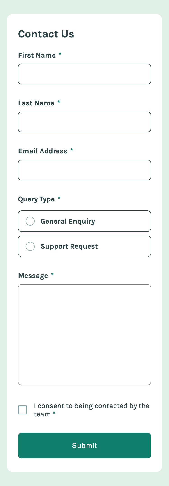
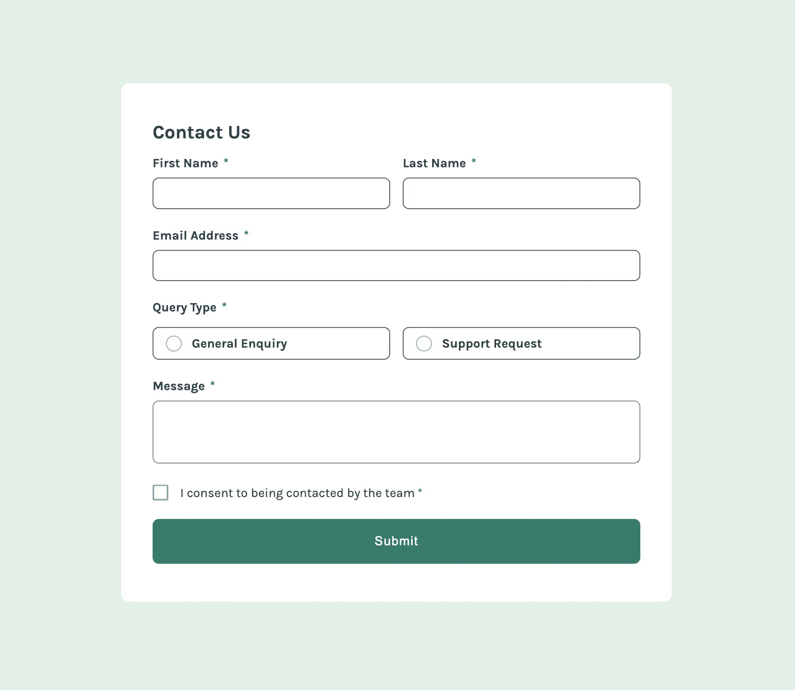
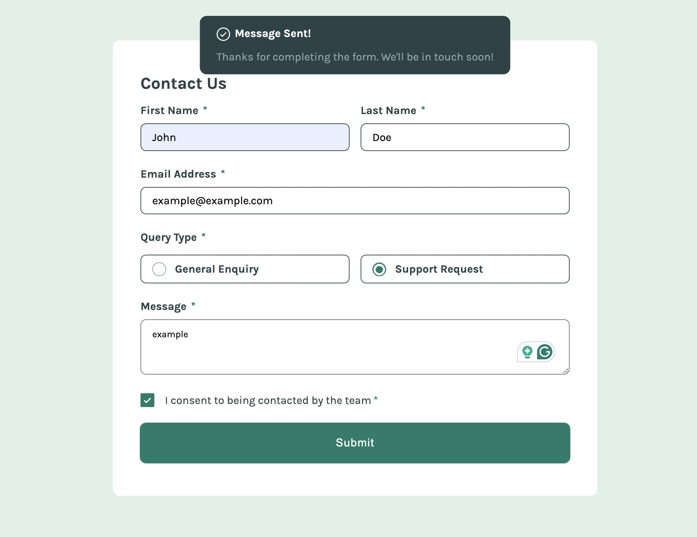

# Frontend Mentor - Contact form solution

This is a solution to the [Contact form challenge on Frontend Mentor](https://www.frontendmentor.io/challenges/contact-form--G-hYlqKJj). Frontend Mentor challenges help you improve your coding skills by building realistic projects.

## Table of contents

-   [Overview](#overview)
    -   [The challenge](#the-challenge)
    -   [Screenshot](#screenshot)
    -   [Links](#links)
-   [My process](#my-process)
    -   [Built with](#built-with)
    -   [What I learned](#what-i-learned)
    -   [Continued development](#continued-development)

## Overview

### The challenge

Users should be able to:

-   Complete the form and see a success toast message upon successful submission
-   Receive form validation messages if:
    -   A required field has been missed
    -   The email address is not formatted correctly
-   Complete the form only using their keyboard
-   Have inputs, error messages, and the success message announced on their screen reader
-   View the optimal layout for the interface depending on their device's screen size
-   See hover and focus states for all interactive elements on the page

### Screenshot





### Links

-   Solution URL: [Add solution URL here](https://your-solution-url.com)
-   Live Site URL: [Add live site URL here](https://your-live-site-url.com)

## My process

### Built with

-   Semantic HTML5 markup
-   CSS custom properties
-   Flexbox
-   Mobile-first workflow

### What I learned

I learned a lot about forms through this project. It was quite challenging to implement all the requirements, such as form validation, error handling, adding ARIA attributes, and completing the form using only the keyboard. In addition, displaying proper outlines along with borders for hover and focus states was also challenging.

```html
<label for="email">Email Address<span class="astarisk">*</span></label>
<input
    type="email"
    id="email"
    name="email"
    aria-describedby="email-error"
    required
/>
<p id="email-valid-error" class="error-message" hidden>
    Please enter a valid email address
</p>
<p id="email-required-error" class="error-message" hidden>
    This field is required
</p>
```

```js
if (!emailInput.value.trim()) {
    toggleAriaInvalid(emailInput, false);
    emailRequiredError.classList.add("visible");
    emailValidError.classList.remove("visible");
    isValid = false;
} else if (!emailInput.validity.valid) {
    toggleAriaInvalid(emailInput, false);
    emailRequiredError.classList.remove("visible");
    emailValidError.classList.add("visible");
    isValid = false;
} else {
    toggleAriaInvalid(emailInput, true);
    emailRequiredError.classList.remove("visible");
    emailValidError.classList.remove("visible");
}
```

### Continued development

I'll continue learning all about forms, including the challenges I mentioned above, and creating custom radio buttons and checkboxes.
# contact-form-main
